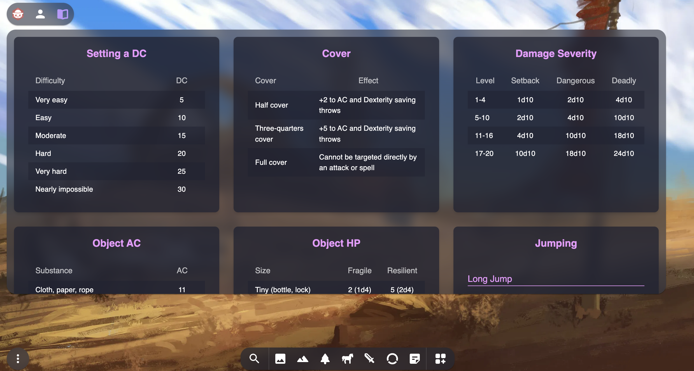

# Owlbear Rodeo DM Screen
A basic DM screen for D&D 5e. It includes various tables and information to assist the Dungeon Master during gameplay.


## Installing
The extension can be installed from the [store page](https://marketplace.owlbear.rodeo/extension/johneckert/dm-screen).

## How It Works

The DM screen is built using Vanilla JS, HTML, and CSS. It is designed to be used within the Owlbear Rodeo platform. When triggered, it provides a clean and organized layout of the various tables and information on the standard DM Screen for quick reference during gameplay.

## Building
This project uses yarn for package management. To run locally:
```bash
yarn install
yarn
yarn dev
```

To make a production build:
```bash
yarn build
``` 

## License
GNU GPL-3.0

## Attribution
This work includes material taken from the System Reference Document 5.1 (“SRD 5.1”) by Wizards of the Coast LLC and available at https://dnd.wizards.com/resources/systems-reference-document. The SRD 5.1 is licensed under the Creative Commons Attribution.

## Contributing
Contributions are welcome! Please feel free to submit a pull request or open an issue if you find a bug or have a feature request.
